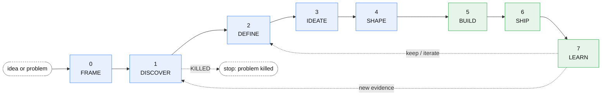
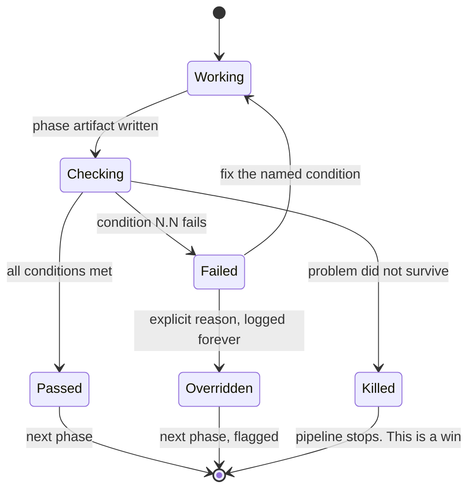
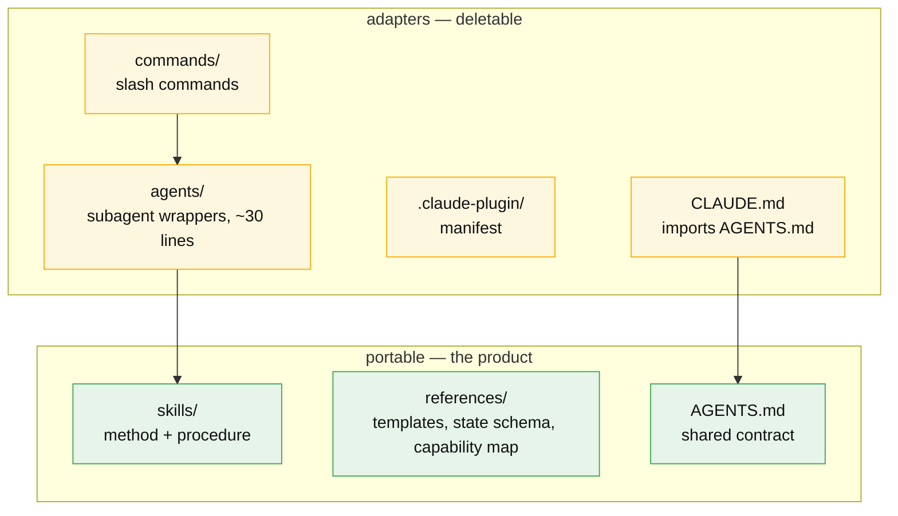
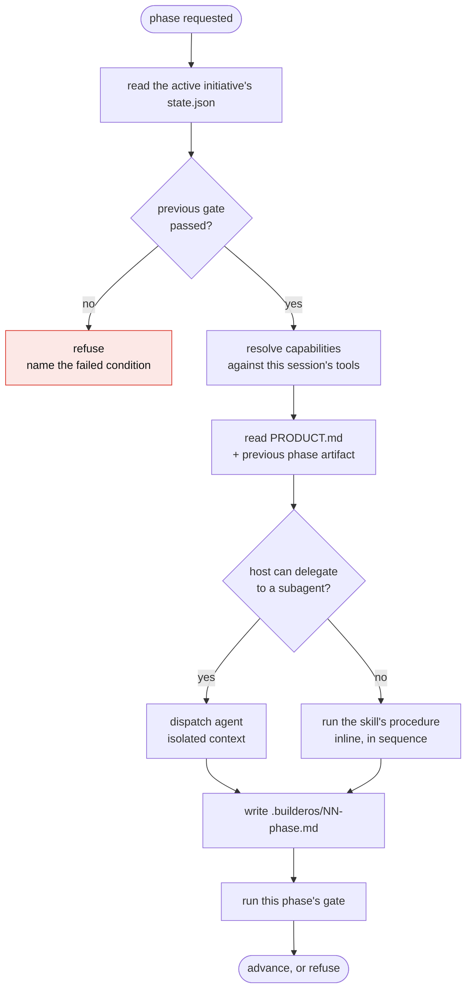
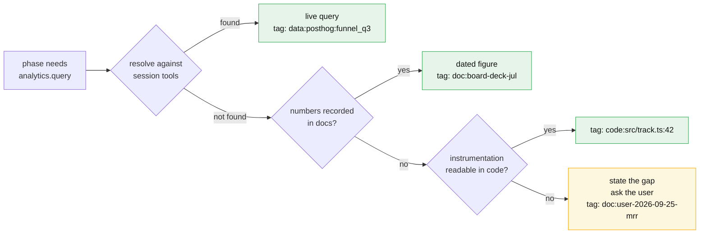

# BuilderOS

**The operating system for product builders.** From an idea or a problem to a product running in production, in eight gated phases.

Not a prompt pack. A pipeline with state, evidence rules and gates that refuse to let you build on fiction.



Phases 0–4 are design thinking: empathize, define, ideate, prototype, test. Phases 5–7 are delivery and learning. Phase 7 re-enters the loop rather than ending it.

Between every pair of phases sits a **gate**.

---

## The three ideas

### 1. Gates you cannot argue with

Each phase ends at a list of conditions decided by *reading* the artifact, not by judging it. Where commands can run, a script with no dependencies (`scripts/bos.mjs`) decides the structural ones, so the model that wrote the artifact does not grade it; the model judges only the few conditions that need meaning, and the state records which was which. Gate 1 does not ask "was the research good?" It asks for five evidence units from five distinct sources and an explicit verdict. Gate 3 wants three options with mechanically different user actions, and kill criteria with a metric, a threshold and a date.



A failed gate produces the failed condition, what was found, what would satisfy it, and the cheapest path there. Overrides exist, take a written reason, and stay visible in every status report afterwards. An undocumented bypass is worse than a documented one.

Not every request needs all eight phases. Before the first one runs, the work is classified into a **track** and the classification is said out loud: a `spike` wants an answer and stops at the phase 1 verdict, a `feature` changes an existing product and starts at phase 2 once `PRODUCT.md` passes a coverage check, a `product` runs everything. A track only ever upgrades: a feature whose evidence turns out missing becomes a product and re-enters phase 0.

### 2. The evidence ledger

Every factual claim in every artifact carries a source tag:

```markdown
Activation drops 62% between signup and first call.  [data:mixpanel:funnel_q3]
Users describe onboarding as "a second job".         [interview:P3,P7]
Enterprise buyers need SSO before evaluating.        [assumption:unvalidated]
```

Every `interview`, `doc` and `data` tag points at a file in `evidence/` holding the raw material: the interview notes, the pasted query output, the excerpt. A tag with no file fails the gate like an untagged claim. Gates count the tags, so an artifact resting on assumptions cannot pass a gate that requires evidence. The file does not make a source true; it makes it auditable, which is the most a text file can do.

Phase 0 is *supposed* to be mostly assumptions. Phase 2 is not: gate 2.4 rejects an estimated baseline outright, because a target measured against a guess makes phase 7 decorative.

### 3. Host-agnostic by construction

The skills hold both the method **and the procedure**. Agents and slash commands are thin adapters over them.



**The test:** delete `agents/`, `commands/` and `.claude-plugin/`, and BuilderOS still takes someone from idea to production. That is why the procedure lives in the skill.

---

## How a phase actually runs

Same steps, same artifacts, same gates, whatever the host.



The only difference between the two paths is context isolation, which is a performance property, not a capability. Nothing is unavailable because of the host.

### Capabilities, not tools

No skill names a tool. It names a capability and resolves it at runtime.



The floor is always the same: say what could not be retrieved and ask. The floor is never a plausible-sounding number.

A hardcoded tool name breaks three ways at once: on a different agent, on a different analytics stack, and on a different user's connector. So there are none. Full list in [`references/capability-map.md`](references/capability-map.md).

**Prerequisites are zero.** Nothing connected, no API key, no vault, no analytics account: every command still runs and still writes its artifact. Reading and writing files is the only hard dependency.

Analytics in particular is a category, not a product. BuilderOS asks five question shapes (catalogue, volume, funnel, retention, breakdown) and Mixpanel, Amplitude, PostHog, a warehouse or a pasted CSV are all valid answers. The shapes, the provider differences that matter, and the floor for each are in [`references/analytics-contract.md`](references/analytics-contract.md).

---

## Two kinds of work

| | Lifecycle | Standalone answer |
|---|---|---|
| **Entry** | `using-builder-os`, then `builder-os` | `using-builder-os`, then one specialist skill |
| **Shape** | Stateful, gated, sequential | Stateless, immediate |
| **For** | Taking something from idea to production | A question about a product that exists: health, growth, finance, competition, OKRs |

You never pick a skill by hand. `using-builder-os` loads at session start, reads the memory, and routes; `/bos-ask` asks it explicitly. `/bos-learn` is the bridge: phase 7 runs the specialists against the phase 2 target and the phase 3 kill criteria.

---

## Install

### Claude Code

```bash
/plugin marketplace add mariomile/builder-os
```

Skills, agents and slash commands all load. The richest surface: each phase runs in an isolated subagent context.

```
/bos-init        start a pipeline from an idea
/bos             stateful hub — routes to the current phase
/bos-status      pipeline state on one screen
/bos-gate        run the current gate
/bos-frame … /bos-learn
```

### Codex and other agents

`AGENTS.md` at the repo root is picked up automatically. Make `skills/` reachable by your host, then name the phase or the skill instead of a slash command. Phases run inline. Same procedure, same artifacts, same gates.

Details and the per-host difference table: [`docs/hosts.md`](docs/hosts.md).

---

## What's in the box

**24 skills.** One entry point (`using-builder-os`: briefing and routing), the lifecycle hub (`builder-os`), three cross-cutting (`gate-checks`, `evidence-ledger`, `pressure-testing`), and the rest split between the eight phases and the specialists that answer standalone questions.

**20 agents.** Claude Code adapters, none longer than 35 lines by contract. They name the skill they load and add only what a delegated context needs: role, Iron Law, context contract, reporting.

**15 commands**, all `/bos-*`. Not sure which one? `/bos-ask`.

**One script.** `scripts/bos.mjs`, Node built-ins only: `brief`, `gate`, `roadmap`, `migrate`. Optional everywhere; where it cannot run, the model applies the same rules and the state says so.

### Project memory

```
PRODUCT.md                what the product is: ICP, problem, non-goals, constraints, voice, language
TECH.md                   how it is built: stack, technical constraints, conventions, known traps
AGENTS.md                 gets a BuilderOS block telling every new session to read the files below first
.builderos/
  ROADMAP.md              the master plan: direction, now / next / later, done and dropped
  decisions/              ADRs, shared across initiatives
  evidence/               the sources behind PRODUCT.md and TECH.md
  local.json              which initiative is active on this checkout (gitignored)
  initiatives/{name}/     one folder per piece of work
    state.json            phase, track, gates, overrides, history
    evidence/             one file per source a tag cites
    00-frame.md           problem, ICP, riskiest assumption
    01-discovery.md       evidence ledger, JTBD, VALIDATED / KILLED / RESHAPED
    02-definition.md      opportunity tree, selected opportunity, success metric
    03-solution-bet.md    options scored, kill criteria
    DESIGN.md             flows, states, components, accessibility
    04-spec.md            scope, not yet specified, acceptance criteria, tracking plan
    05-build-plan.md      tracer tickets, test map, review record
    06-release.md         rollout, rollback test, baseline
    07-outcome.md         actual vs target, keep / iterate / kill
    questionnaires/       async questions for people the user cannot interview
```

Every session starts by reading the roadmap, each initiative's `state.json`, `PRODUCT.md` and, when code is involved, `TECH.md`, and briefs you in five lines on where things stand, plus one line when something is rotting: an outcome review past its date, a `TECH.md` not checked since the dependencies changed, an initiative untouched for a month. On Claude Code the session-start hook does it; on any other host the block `/bos-init` writes into your project's `AGENTS.md` does. Several initiatives can be open at once; one is active, and every command acts on it.

Each phase reads the one before it. Starting phase 3 without `02-definition.md` produces confident fiction, so the hub refuses.

---

## Status

Version 1.0.0. Honest state:

| Area | Status |
|------|--------|
| Spine — state, gates, evidence ledger, pressure testing, `/bos-init`, `/bos`, `/bos-status`, `/bos-gate` | Shipped |
| Phases 0–7 — all eight, each with its own skills, procedure and enforceable gate | Shipped |
| Host portability | Applied across the whole repo. No tool identifier in any skill, agent or command |
| Zero prerequisites | Every command runs with nothing connected; files are the only hard dependency |
| Runtime verification | **Not yet run end to end in a live session.** Structurally complete, behaviorally unverified |

That last row is the one to read. Everything here is written to contract and checked mechanically; none of it has been executed against a real product yet.

Roadmap and task state: [`docs/plans/2026-09-20-lifecycle-os-v1.md`](docs/plans/2026-09-20-lifecycle-os-v1.md).

---

## Influences

Patterns borrowed, not dependencies. BuilderOS installs on its own.

- [obra/superpowers](https://github.com/obra/superpowers) — phase discipline with hard refusal to skip ahead, "evidence over claims", the short bootstrap skill with its red-flags table, and classifying work into paths before starting
- [mattpocock/skills](https://github.com/mattpocock/skills) — small composable skills, interview rounds with a recommended answer per question, the async questionnaire, the ADR test, the glossary, and "not yet specified" kept apart from out of scope
- [pbakaus/impeccable](https://github.com/pbakaus/impeccable) — durable product truth kept separate from surface decisions, deterministic detectors

---

## Docs

| | |
|---|---|
| [`AGENTS.md`](AGENTS.md) | The shared contract: architecture, principles, non-negotiables |
| [`docs/architecture.md`](docs/architecture.md) | How the pieces fit, in diagrams |
| [`docs/hosts.md`](docs/hosts.md) | Running on Claude Code, Codex, anything else |
| [`references/capability-map.md`](references/capability-map.md) | The 15 capabilities and their degradation ladders |
| [`references/analytics-contract.md`](references/analytics-contract.md) | The five analytics question shapes, and what they mean per provider |
| [`references/builderos-state-schema.md`](references/builderos-state-schema.md) | `.builderos/` layout and `state.json` |

MIT.
