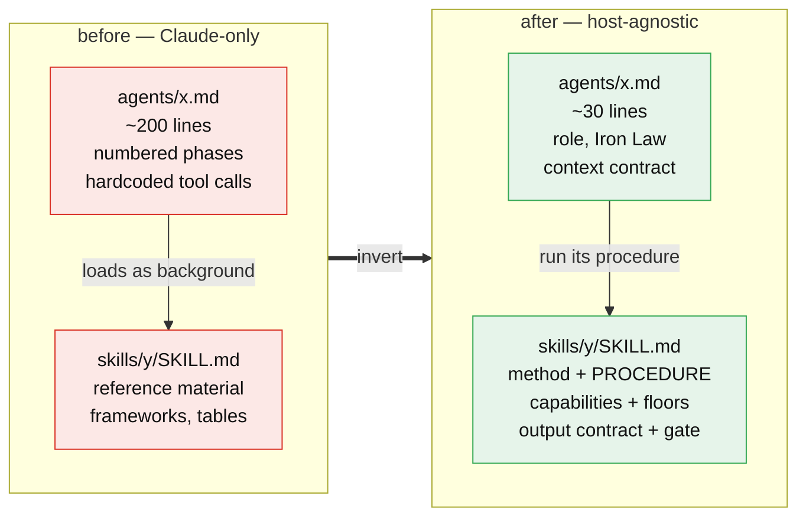
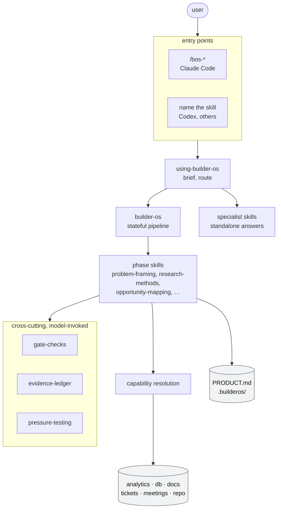
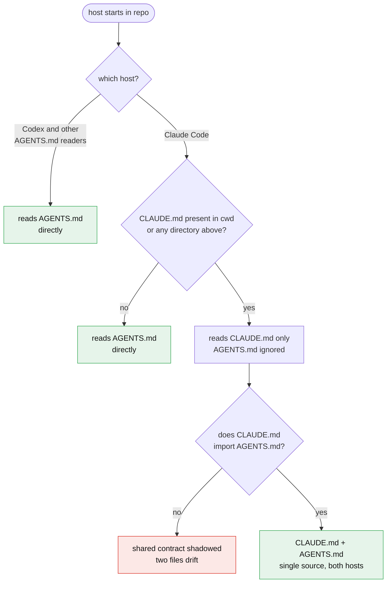
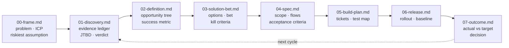

# Architecture

How the pieces fit. Start at the [README](../README.md) for what BuilderOS does; this is how it is built.

---

## 1. The inversion

The single decision that shapes everything else: **skills hold the procedure, agents are adapters.**



Before the inversion, loading a BuilderOS skill on a host without subagents gave you a PMF scoring table and no idea what to do with it. The workflow lived in a Claude Code construct.

After it, the skill is self-executing. The agent adds only what a *delegated* context needs: who it is, its Iron Law, the context package it receives, how to report.

**Enforced by contract.** An agent longer than about 40 lines has almost certainly stolen something from its skill. See `CLAUDE.md`.

---

## 2. Layers



`references/` sits beside all of it: templates, the state schema, the capability map. Not a layer, a shared vocabulary.

---

## 3. Instruction files

Which file the host reads as project instructions, and why this repo is arranged the way it is.



This repo takes the right-hand path: `CLAUDE.md` starts with `@AGENTS.md`.

| File | Holds | Read by |
|------|-------|---------|
| `AGENTS.md` | Architecture, design principles, non-negotiables, portability rules, skill contract, testing, contributing | Codex directly; Claude Code through the import |
| `CLAUDE.md` | Adapter directories, agent contract, command contract, dispatch context package | Claude Code |

**Rule for contributors:** true on every host → `AGENTS.md`. About subagents, slash commands or the plugin manifest → `CLAUDE.md`. Never the same rule in both.

Two things worth knowing. A `CLAUDE.md` *above* the working directory also suppresses direct `AGENTS.md` reading, which matters when BuilderOS sits inside a larger repo. And direct reading needs a recent Claude Code, while the import works regardless. Both are reasons the import is not optional here.

---

## 4. The artifact chain

Every phase consumes the previous artifact and produces the next. This is what makes the pipeline stateful rather than a themed prompt sequence.



`PRODUCT.md` sits outside the chain and is read by every phase.

Concretely, what each phase inherits:

| Phase | Reads | Extracts from it |
|-------|-------|------------------|
| 1 Discover | `00-frame.md` | The riskiest assumption becomes the research target; reachability shapes recruiting; prior-art class shapes who to chase first |
| 2 Define | `01-discovery.md` | Every evidence tag becomes a candidate node in the opportunity tree |
| 3 Ideate | `02-definition.md` | The selected opportunity and the metric the bet must move |
| 4 Shape | `03-solution-bet.md` | The bet, its kill criteria, the assumption still to test |
| 5 Build | `04-spec.md` | Acceptance criteria map one-to-one to tests |
| 6 Ship | `05-build-plan.md` | What to roll out, what to instrument |
| 7 Learn | `06-release.md` + live data | Baseline and target to judge against |

`PRODUCT.md` is separate on purpose: it holds identity, not decisions. It changes when the ICP or the problem changes, never because a feature shipped.

---

## 5. The eight gates

Full conditions in `skills/gate-checks/SKILL.md`. The shape of each:

| Gate | Refuses to pass when |
|------|---------------------|
| 0 Frame | Problem statement contains solution language · no single ICP with a sourced size · riskiest assumption not falsifiable · why-now is a preference, not a dated change |
| 1 Discover | Fewer than 5 primary evidence units from 5 distinct sources · no explicit verdict · no JTBD · disconfirming evidence never sought |
| 2 Define | Fewer than 3 traced opportunities · no written rejections · **baseline is an estimate** · scale bet at pre-PMF |
| 3 Ideate | Options share the same primary user action · kill criteria missing a metric, threshold or date · riskiest assumption has no priced test |
| 4 Shape | Acceptance criteria not testable · out-of-scope list empty · flows missing error and empty states · tracking plan does not measure the phase 2 metric |
| 5 Build | An acceptance criterion with no test · tests claimed rather than shown · instrumentation not verified firing · out-of-scope items got built |
| 6 Ship | No rollback path · baseline captured after exposure · no dashboard for the metric · no outcome review scheduled |
| 7 Learn | Actual not compared to target · kill criteria never evaluated · no keep/iterate/kill decision |

Two design notes.

**`KILLED` is a pass.** Phase 1 returning "this problem is not worth solving" stops the pipeline and is the cheapest outcome the system can produce. It is reported as a win.

**Lite mode** relaxes elaboration conditions for small features, and never relaxes the ones that prevent building on fiction: evidence thresholds, kill criteria, test mapping, rollback, baseline.

---

## 6. Phase map

| # | Phase | Skills | Agents | Command |
|---|-------|--------|--------|---------|
| 0 | Frame | `problem-framing` | `problem-framer` | `/bos-frame` |
| 1 | Discover | `research-methods`, `discovery-methods` | `research-planner`, `discovery-synthesizer` | `/bos-discover` |
| 2 | Define | `opportunity-mapping`, `strategy-frameworks` | `opportunity-mapper`, `product-strategist`, `north-star-analyst` | `/bos-define` |
| 3 | Ideate | `ideation-methods`, `experiment-methodology` | `solution-architect`, `experiment-designer` | `/bos-ideate` |
| 4 | Shape | `spec-writing`, `ux-architecture`, `pm-artifacts` | `spec-writer`, `ux-architect`, `product-writer` | `/bos-shape` |
| 5 | Build | `delivery-discipline`, `tracking-standards` | `delivery-planner`, `build-reviewer`, `tracking-architect` | `/bos-build` |
| 6 | Ship | `release-ops`, `pm-artifacts` | `release-manager`, `product-writer` | `/bos-ship` |
| 7 | Learn | `outcome-review`, `saas-metrics-reference`, `growth-frameworks`, `okr-frameworks`, `financial-models` | `product-diagnostician`, `growth-architect`, `finance-analyst`, `okr-architect` | `/bos-learn` |

All eight phases are live. Phase 7 adds no new specialist: it orchestrates the analysis agents against the phase 2 target and the phase 3 kill criteria, with `outcome-review` holding the judging procedure so the phase also runs on a host with no agents at all.

`/bos-adr` is callable from any phase, the moment a decision becomes expensive to unwind.

Cross-cutting, callable from any phase: `gate-checks`, `evidence-ledger`, `pressure-testing`.

---

## 7. Capabilities

Fifteen named capabilities, resolved at runtime by matching the tools a session actually exposes. Never by name, never assumed.

```
analytics.query · analytics.events · analytics.replay
db.query
docs.search · docs.read · docs.write
tickets.read · meetings.read · research.search
web.search · web.fetch
repo.read · files.read · files.write
subagent.dispatch
```

`files.read` and `files.write` are the only ones always assumed — `.builderos/` depends on them. Everything else has a degradation ladder and a floor, listed in [`../references/capability-map.md`](../references/capability-map.md).

The operating mode is a *summary* of what resolved, not a list of installed products:

| Mode | Resolved | Consequence |
|------|----------|-------------|
| connected | `analytics.query` or `db.query` | Real baselines; gates 2.4, 5.3, 6.2 satisfiable |
| vault-based | `docs.search` over local notes | Phases 0–4 fully usable |
| codebase-based | `repo.read` only | Phases 4–6 strongest |
| conversational | nothing beyond files | Phases 0–3 fully usable |

An idea with no product and no data is the normal entry point, not a degraded one.

---

## 8. Design debt

Stated plainly rather than discovered later.

| Debt | Size | Plan |
|------|------|------|
| No automated skill-triggering harness — prompts exist, no runner | Medium | Out of scope for v1.0; gates are the mechanical safety net |
| Nothing has been executed in a live session: structurally complete, behaviorally unverified | Large | Tasks 1.9, 2.6, 2b.6, 3.4, 4.3, 5.6 in the plan |
| The benchmark bands in `saas-metrics-reference` are working heuristics, not sourced benchmarks | Small | Replace with the product's own history once two quarters exist |

Roadmap: [`plans/2026-09-20-lifecycle-os-v1.md`](plans/2026-09-20-lifecycle-os-v1.md).
