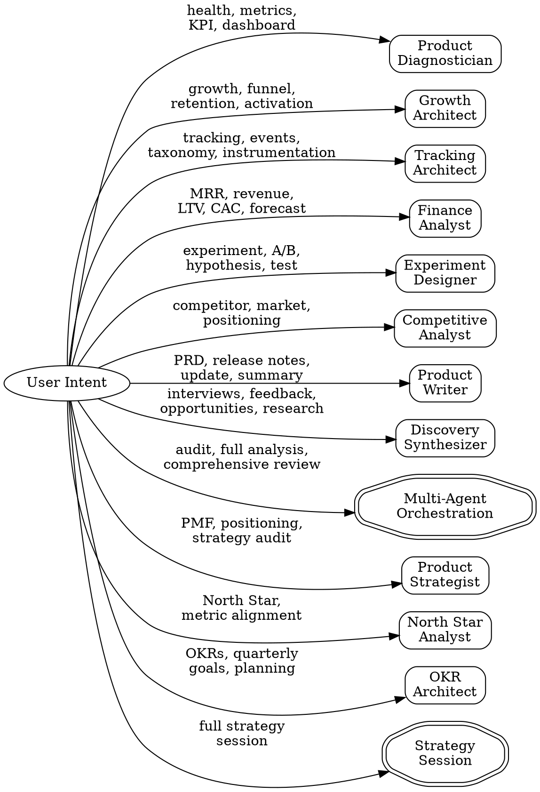

# PM Toolkit (BuilderOS)

Operational Product Management toolkit. It resolves whatever data capabilities the session exposes and adapts to them, from a live analytics connection down to nothing but the conversation. Prerequisites are zero: reading and writing files is the only hard dependency.

## Scope

This skill is the **analysis surface**: stateless questions about a product that already exists and already emits data. Health, growth, tracking, finance, experiments, competition, artifacts, strategy.

For taking an idea or a problem *toward* a product — framing, research, opportunity mapping, bet selection, spec, delivery, release — load `builder-os` instead. That skill owns the gated 8-phase pipeline and routes back here for phase 7 (Learn).

Rule of thumb: `pm-*` answers a question, `bos-*` walks a pipeline.

## Iron Law

**Never invent data.** If you cannot pull real numbers, work with what you have — vault notes, user-provided data, or codebase analysis. Label every data point with its source. Estimated or hallucinated metrics are worse than no metrics.

## When to Use

Use this skill when the user asks to:
- Analyze product health, metrics, KPIs
- Diagnose growth issues, funnel drop-offs, retention problems
- Create tracking plans or event taxonomies
- Design experiments or analyze A/B test results
- Model revenue, unit economics, or financial projections
- Research competitors or market positioning
- Write PRDs, release notes, stakeholder updates
- Synthesize user research or interview transcripts

## Operating Modes

BuilderOS adapts to whatever the session actually exposes. **Resolve capabilities before dispatching anything.**

### Resolution Protocol

Run the protocol in `references/capability-map.md`: enumerate the tools this session exposes, match them to capabilities by shape rather than by name, record what resolved, and degrade explicitly where nothing does.

Never test for a specific tool identifier. Connector instances are named per user, so `mixpanel` in one session is a different string from `mixpanel` in another, and a skill that tests for either is broken for everyone else.

The analytics side of that resolution is specified in `references/analytics-contract.md`: five question shapes, answered by whichever of Mixpanel, Amplitude, PostHog, a warehouse or the user resolved.

### Operating Modes

A mode is a summary of what resolved, not a configuration anyone sets.

| Mode | Means | Strongest for |
|------|-------|---------------|
| **connected** | `analytics.query` or `db.query` resolved | Everything. Baselines are real |
| **vault-based** | `docs.search` resolved against notes; no live data | Strategy, discovery, artifacts |
| **codebase-based** | Only `repo.read` and `files.*` | Tracking audits, spec work, instrumentation gaps |
| **conversational** | Nothing resolved | Framing, strategy, artifact drafting. The normal state for a new idea |

**Zero prerequisites.** Every command in this toolkit runs with nothing connected. `files.read` and `files.write` are the only hard dependency. Each skill states its floor per capability, and no floor is a fabricated number: it is reading the code, reading a document, asking the user, or naming the gap.

### Capability Gaps

When a capability did not resolve and it would have sharpened the work, say so once, at the end, in capability terms:

```markdown
> **What would sharpen this:** a retention curve would replace the stated assumption about
> week-4 behavior with a measured one. Any product analytics source answers it; so does a
> CSV export.
```

Name the shape and the question it would answer. Never name a product the user should go install, and never list every possible integration: only the gap that mattered to this analysis.


## Available Agents

Route to the appropriate agent based on user intent:

| Intent | Agent | Command |
|--------|-------|---------|
| Product health, metric analysis, anomaly detection | `product-diagnostician` | `/pm-health` |
| Activation funnels, retention, growth loops | `growth-architect` | `/pm-growth` |
| Event taxonomy, tracking plans, dashboard specs | `tracking-architect` | `/pm-track` |
| MRR, unit economics, revenue projections | `finance-analyst` | `/pm-finance` |
| Hypothesis, A/B test design, results analysis | `experiment-designer` | `/pm-experiment` |
| Market analysis, competitive brief, positioning | `competitive-analyst` | `/pm-compete` |
| PRDs, release notes, stakeholder updates | `product-writer` | `/pm-prd` or `/pm-release` |
| Interview synthesis, opportunity scoring | `discovery-synthesizer` | `/pm-discovery` |
| Full product audit (parallel agents) | Multi-agent orchestration | `/pm-audit` |
| PMF assessment, positioning audit, strategic gaps | `product-strategist` | `/pm-strategy` |
| North Star metric selection, metric alignment | `north-star-analyst` | `/pm-northstar` |
| Quarterly OKRs, goal setting, KR writing | `okr-architect` | `/pm-okr` |
| Full strategy session (PMF → NSM → OKRs) | Sequential: `product-strategist` → `north-star-analyst` → `okr-architect` | `/pm-strategy-session` |

## Routing Logic



## Product Context Protocol

Before dispatching any agent, gather product context:

1. **Look for `PM-CONTEXT.md`** in the current project root
2. **If in an Obsidian vault**, look for `context.md` of the relevant project in `1. Actions/`
3. **If in a codebase**, extract context from `package.json`, `README.md`, analytics configs
4. **If nothing found**, ask the user for minimal context:
   - Product name
   - Stage (seed / series-a / growth)
   - Key activation event (if analytics-related)
5. **Save the context** to `PM-CONTEXT.md` for future sessions

Pass the full context AND the detected operating mode to the dispatched agent.

## Agent Dispatch Pattern

When routing to an agent, use the Agent tool with:

```
Agent({
  description: "[Agent purpose] for [product name]",
  subagent_type: "[agent-name]",
  prompt: "Operating mode: [connected / vault-based / codebase-based / conversational]
Resolved capabilities: [capability → the concrete tool it resolved to, or 'none']
Product context:
[PM-CONTEXT.md content or extracted context]

User request:
[what the user asked for]

Specific parameters:
[any specific metrics, date ranges, segments mentioned]"
})
```

Always include:
- The operating mode, as a summary of what resolved
- The resolved capabilities, each named with the concrete tool behind it, so the agent's evidence tags can name the real source
- Full product context
- The user's original request

Where `subagent.dispatch` does not resolve, there is no Agent tool. Run the same skill Procedure inline, in sequence, and produce the same artifact. The procedure lives in the skill precisely so this path exists.

## Multi-Agent Orchestration

For `/pm-audit` or requests like "give me a full product analysis":

1. Dispatch **Product Diagnostician** + **Growth Architect** + **Finance Analyst** in parallel using the Agent tool
2. Wait for all three to complete (look for their completion markers)
3. Synthesize findings into a unified executive summary

## Completion Markers

Each agent ends its output with a structured marker:

| Agent | Marker |
|-------|--------|
| Product Diagnostician | `## DIAGNOSIS COMPLETE` |
| Growth Architect | `## GROWTH ANALYSIS COMPLETE` |
| Tracking Architect | `## TRACKING PLAN COMPLETE` |
| Finance Analyst | `## FINANCIAL ANALYSIS COMPLETE` |
| Experiment Designer | `## EXPERIMENT DESIGN COMPLETE` |
| Competitive Analyst | `## COMPETITIVE ANALYSIS COMPLETE` |
| Product Writer | `## ARTIFACT WRITTEN` |
| Discovery Synthesizer | `## DISCOVERY SYNTHESIS COMPLETE` |
| Product Strategist | `## STRATEGY AUDIT COMPLETE` |
| North Star Analyst | `## NORTH STAR COMPLETE` |
| OKR Architect | `## OKR COMPLETE` |

## Red Flags

STOP and correct course if you notice:

| Behavior | Problem | Fix |
|----------|---------|-----|
| Agent reports a metric with no tag | The number is invented | Every number carries its source, or is marked unavailable |
| "Approximately" or "estimated" without a tag | Source unclear | Tag every number per `evidence-ledger`: `[mcp:{provider}:{query}]`, `[doc:{source}]`, `[doc:user-provided]` |
| Agent ignores a capability that resolved | Missed data | Re-dispatch with the resolved capability list explicit |
| Agent names a product for the user to install | Vendor coupling | State the capability gap and the question it would answer |
| Output missing completion marker | Agent didn't finish | Re-dispatch or investigate |
