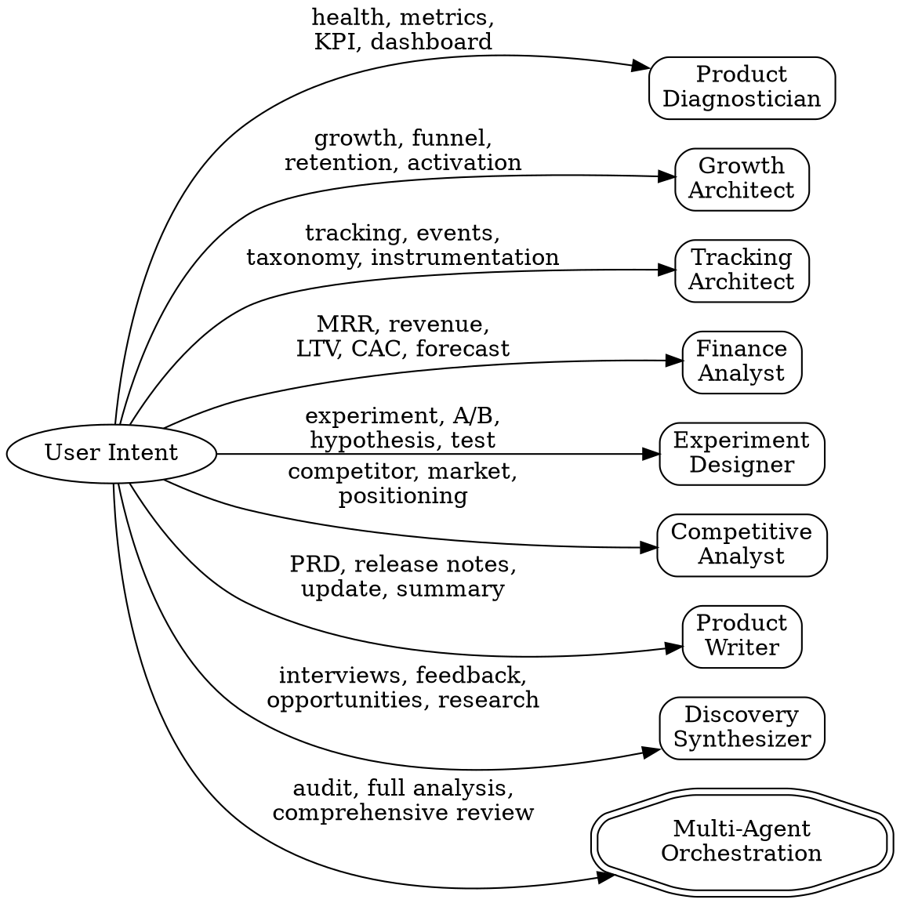

# PM Toolkit

Operational Product Management toolkit. Connects to live analytics (Mixpanel, PostHog), databases (Supabase), and docs (Notion, Google Drive) via MCP to produce actionable PM artifacts.

## Iron Law

**Never invent data.** If you cannot pull real numbers from MCP, say so and ask the user. Estimated or hallucinated metrics are worse than no metrics.

## When to Use

Use this skill when the user asks to:
- Analyze product health, metrics, KPIs
- Diagnose growth issues, funnel drop-offs, retention problems
- Create tracking plans or event taxonomies
- Design experiments or analyze A/B test results
- Model revenue, unit economics, or financial projections
- Research competitors or market positioning
- Write PRDs, release notes, stakeholder updates
- Synthesize user research or interview transcripts

## Available Agents

Route to the appropriate agent based on user intent:

| Intent | Agent | Command |
|--------|-------|---------|
| Product health, metric analysis, anomaly detection | `product-diagnostician` | `/pm-health` |
| Activation funnels, retention, growth loops | `growth-architect` | `/pm-growth` |
| Event taxonomy, tracking plans, dashboard specs | `tracking-architect` | `/pm-track` |
| MRR, unit economics, revenue projections | `finance-analyst` | `/pm-finance` |
| Hypothesis, A/B test design, results analysis | `experiment-designer` | `/pm-experiment` |
| Market analysis, competitive brief, positioning | `competitive-analyst` | `/pm-compete` |
| PRDs, release notes, stakeholder updates | `product-writer` | `/pm-prd` or `/pm-release` |
| Interview synthesis, opportunity scoring | `discovery-synthesizer` | `/pm-discovery` |
| Full product audit (parallel agents) | Multi-agent orchestration | `/pm-audit` |

## Routing Logic



## Product Context Protocol

Before dispatching any agent, check for product context:

1. **Look for `PM-CONTEXT.md`** in the current project root
2. **If not found**, look for `.pm-toolkit/context.md`
3. **If neither exists**, ask the user for minimal context:
   - Product name
   - Stage (seed / series-a / growth)
   - Mixpanel project ID (if analytics agent needed)
   - Key activation event name
4. **Save the context** to `PM-CONTEXT.md` for future sessions

Pass the full context to the dispatched agent.

## Multi-Agent Orchestration

For `/pm-audit` or requests like "give me a full product analysis":

1. Dispatch **Product Diagnostician** + **Growth Architect** + **Finance Analyst** in parallel using the Agent tool
2. Wait for all three to complete (look for their completion markers)
3. Synthesize findings into a unified executive summary:
   - Health scorecard (from Diagnostician)
   - Growth bottlenecks and recommendations (from Growth Architect)
   - Revenue health and projections (from Finance Analyst)
   - Cross-cutting themes and priority actions

## Agent Dispatch Pattern

When routing to an agent, use the Agent tool with:

```
Agent({
  description: "[Agent purpose] for [product name]",
  subagent_type: "[agent-name]",
  prompt: "Product context:\n[PM-CONTEXT.md content]\n\nUser request:\n[what the user asked for]\n\nSpecific parameters:\n[any specific metrics, date ranges, segments mentioned]"
})
```

Always include:
- Full PM-CONTEXT.md content (don't make the agent search for it)
- The user's original request
- Any specific parameters mentioned (date ranges, segments, metrics)

## Completion Markers

Each agent ends its output with a structured marker. Verify you see the marker before presenting results to the user:

| Agent | Marker |
|-------|--------|
| Product Diagnostician | `## DIAGNOSIS COMPLETE` |
| Growth Architect | `## GROWTH ANALYSIS COMPLETE` |
| Tracking Architect | `## TRACKING PLAN COMPLETE` |
| Finance Analyst | `## FINANCIAL ANALYSIS COMPLETE` |
| Experiment Designer | `## EXPERIMENT DESIGN COMPLETE` |
| Competitive Analyst | `## COMPETITIVE ANALYSIS COMPLETE` |
| Product Writer | `## ARTIFACT WRITTEN` |
| Discovery Synthesizer | `## DISCOVERY SYNTHESIS COMPLETE` |

## Red Flags

STOP and correct course if you notice:

| Behavior | Problem | Fix |
|----------|---------|-----|
| Agent reports metrics without MCP calls | Data is hallucinated | Re-run with explicit MCP queries |
| "Approximately" or "estimated" for live data | Agent guessed instead of querying | Force MCP pull |
| Agent suggests frameworks without data | Generic advice, not operational | Pull data first, then recommend |
| Output missing completion marker | Agent didn't finish | Re-dispatch or investigate |
| Multiple agents returning contradictory data | Data inconsistency | Verify source queries, reconcile |
