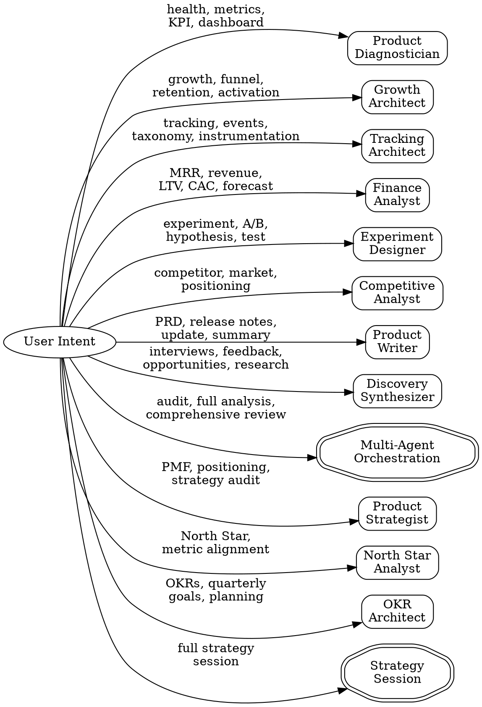

# PM Toolkit (BuilderOS)

Operational Product Management toolkit. Works in three modes: **MCP-connected** (live analytics), **vault-based** (Obsidian notes), or **codebase-based** (Claude Code on a project). Adapts automatically to the available data sources.

## Iron Law

**Never invent data.** If you cannot pull real numbers, work with what you have — vault notes, user-provided data, or codebase analysis. Label every data point with its source. Estimated or hallucinated metrics are worse than no metrics.

## When to Use

Use this skill when the user asks to:
- Analyze product health, metrics, KPIs
- Diagnose growth issues, funnel drop-offs, retention problems
- Create tracking plans or event taxonomies
- Design experiments or analyze A/B test results
- Model revenue, unit economics, or financial projections
- Research competitors or market positioning
- Write PRDs, release notes, stakeholder updates
- Synthesize user research or interview transcripts

## Operating Modes

BuilderOS adapts to the environment it's running in. **Detect the mode before dispatching any agent.**

### Mode Detection Protocol

Run these checks in order:

```
1. Check for MCP tools:
   - mcp__claude_ai_DeepAgent_Mixpanel__* → Mixpanel available
   - mcp__plugin_supabase-toolkit_supabase__* → Supabase available
   - mcp__claude_ai_Notion__* → Notion available
   - mcp__claude_ai_PostHog__* → PostHog available
   - mcp__claude_ai_Readwise__* → Readwise available
   - mcp__claude_ai_Randrop_io__* → Raindrop available

2. Check for vault context:
   - Is working directory an Obsidian vault? (look for .obsidian/)
   - Are there PM-related notes? (grep for metric, product, growth, etc.)

3. Check for codebase context:
   - Is there a package.json, Gemfile, requirements.txt, etc.?
   - Is there analytics tracking code? (grep for mixpanel, posthog, segment, etc.)
   - Is there a PM-CONTEXT.md?
```

### Three Operating Modes

| Mode | When | Data Sources | Power Level |
|------|------|-------------|-------------|
| **MCP-connected** | MCP tools detected | Live queries to Mixpanel, Supabase, Notion, etc. | Full — real-time data, automated dashboards |
| **Vault-based** | Obsidian vault detected, no MCP | Vault notes, Readwise highlights, Raindrop bookmarks | Medium — curated knowledge, manual metrics |
| **Codebase-based** | Code project, no vault/MCP | Source code, configs, git history, README | Focused — code-aware analysis, tracking audit |

### Mode-Specific Behavior

**MCP-connected mode:**
- Agents make explicit MCP calls for live data
- Output includes real numbers with source attribution
- Can create dashboards, write to Notion, export to Google Drive

**Vault-based mode:**
- Agents search vault notes for documented metrics, decisions, strategies
- Use `Grep` and `Glob` to find relevant notes
- Use Readwise/Raindrop MCP if available for enrichment
- Output references vault notes with `[[wikilinks]]`
- Suggest: "For live data, connect Mixpanel MCP: `mcp__claude_ai_DeepAgent_Mixpanel`"

**Codebase-based mode:**
- Agents analyze code for tracking implementation, feature structure, config
- Read `package.json`, analytics configs, event definitions in code
- Output includes file paths and code references
- Suggest: "For product metrics, connect Mixpanel or PostHog MCP"

### MCP Enhancement Suggestions

When an agent operates WITHOUT a useful MCP, include a suggestion at the end of its output:

```markdown
> **Enhance this analysis:** Connect [{MCP name}] for [{what it enables}].
> - Mixpanel MCP → live metrics, funnels, retention cohorts
> - Supabase MCP → revenue data, billing queries, user tables
> - PostHog MCP → session replays, feature flags, experiments
> - Notion MCP → write PRDs directly, sync interview databases
> - Linear MCP → connect roadmap items to metrics
```

Only suggest MCPs that are **directly relevant** to the current analysis. Don't list all of them.

## Available Agents

Route to the appropriate agent based on user intent:

| Intent | Agent | Command |
|--------|-------|---------|
| Product health, metric analysis, anomaly detection | `product-diagnostician` | `/pm-health` |
| Activation funnels, retention, growth loops | `growth-architect` | `/pm-growth` |
| Event taxonomy, tracking plans, dashboard specs | `tracking-architect` | `/pm-track` |
| MRR, unit economics, revenue projections | `finance-analyst` | `/pm-finance` |
| Hypothesis, A/B test design, results analysis | `experiment-designer` | `/pm-experiment` |
| Market analysis, competitive brief, positioning | `competitive-analyst` | `/pm-compete` |
| PRDs, release notes, stakeholder updates | `product-writer` | `/pm-prd` or `/pm-release` |
| Interview synthesis, opportunity scoring | `discovery-synthesizer` | `/pm-discovery` |
| Full product audit (parallel agents) | Multi-agent orchestration | `/pm-audit` |
| PMF assessment, positioning audit, strategic gaps | `product-strategist` | `/pm-strategy` |
| North Star metric selection, metric alignment | `north-star-analyst` | `/pm-northstar` |
| Quarterly OKRs, goal setting, KR writing | `okr-architect` | `/pm-okr` |
| Full strategy session (PMF → NSM → OKRs) | Sequential: `product-strategist` → `north-star-analyst` → `okr-architect` | `/pm-strategy-session` |

## Routing Logic



## Product Context Protocol

Before dispatching any agent, gather product context:

1. **Look for `PM-CONTEXT.md`** in the current project root
2. **If in an Obsidian vault**, look for `context.md` of the relevant project in `1. Actions/`
3. **If in a codebase**, extract context from `package.json`, `README.md`, analytics configs
4. **If nothing found**, ask the user for minimal context:
   - Product name
   - Stage (seed / series-a / growth)
   - Key activation event (if analytics-related)
5. **Save the context** to `PM-CONTEXT.md` for future sessions

Pass the full context AND the detected operating mode to the dispatched agent.

## Agent Dispatch Pattern

When routing to an agent, use the Agent tool with:

```
Agent({
  description: "[Agent purpose] for [product name]",
  subagent_type: "[agent-name]",
  prompt: "Operating mode: [mcp-connected / vault-based / codebase-based]
Available MCP tools: [list detected MCP tools, or 'none']
Product context:
[PM-CONTEXT.md content or extracted context]

User request:
[what the user asked for]

Specific parameters:
[any specific metrics, date ranges, segments mentioned]"
})
```

Always include:
- The detected operating mode
- List of available MCP tools
- Full product context
- The user's original request

## Multi-Agent Orchestration

For `/pm-audit` or requests like "give me a full product analysis":

1. Dispatch **Product Diagnostician** + **Growth Architect** + **Finance Analyst** in parallel using the Agent tool
2. Wait for all three to complete (look for their completion markers)
3. Synthesize findings into a unified executive summary

## Completion Markers

Each agent ends its output with a structured marker:

| Agent | Marker |
|-------|--------|
| Product Diagnostician | `## DIAGNOSIS COMPLETE` |
| Growth Architect | `## GROWTH ANALYSIS COMPLETE` |
| Tracking Architect | `## TRACKING PLAN COMPLETE` |
| Finance Analyst | `## FINANCIAL ANALYSIS COMPLETE` |
| Experiment Designer | `## EXPERIMENT DESIGN COMPLETE` |
| Competitive Analyst | `## COMPETITIVE ANALYSIS COMPLETE` |
| Product Writer | `## ARTIFACT WRITTEN` |
| Discovery Synthesizer | `## DISCOVERY SYNTHESIS COMPLETE` |
| Product Strategist | `## STRATEGY AUDIT COMPLETE` |
| North Star Analyst | `## NORTH STAR COMPLETE` |
| OKR Architect | `## OKR COMPLETE` |

## Red Flags

STOP and correct course if you notice:

| Behavior | Problem | Fix |
|----------|---------|-----|
| Agent reports metrics without any data source | Data is hallucinated | Must use MCP, vault, or user-provided data |
| "Approximately" or "estimated" without label | Source unclear | Label every number: `[Mixpanel]`, `[vault note]`, `[user-provided]` |
| Agent ignores available MCP tools | Missed opportunity | Re-dispatch with explicit MCP tool list |
| Agent suggests MCP when it's already available | Didn't detect tools | Fix mode detection |
| Output missing completion marker | Agent didn't finish | Re-dispatch or investigate |
